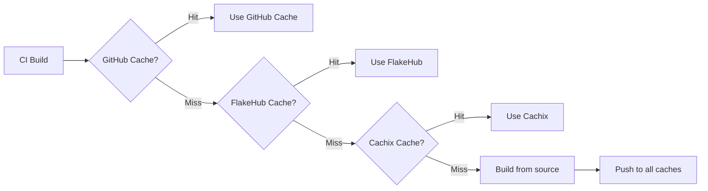

# Multi-Layer Caching Setup Guide

This repository uses **three layers of caching** for optimal CI/CD performance:

## 🚀 Cache Layers Overview

### For CI/CD (GitHub Actions)

1. **GitHub Actions Cache** (Layer 1)
   - Free, built-in, 10GB limit
   - Stores: Nix store, Cargo artifacts
   - Fastest for GitHub Actions runners

2. **FlakeHub Cache** (Layer 2)
   - Determinate Systems' binary cache
   - Public, unlimited for OSS
   - Provides pre-built binaries

3. **Cachix Cache** (Layer 3)
   - Community binary cache
   - 5GB free, unlimited for OSS
   - Shareable across projects

4. **sccache** (Compilation Cache)
   - 10GB compiler cache in CI
   - Speeds up builds across multiple jobs
   - **CI ONLY** - not for local development

### For Local Development

For local development, use:
- **Cargo's incremental compilation** (automatic, fastest)
- **Nix caches** (FlakeHub + Cachix for dependencies)
- **NOT sccache** (slower locally than incremental)

```bash
# Local development (fast)
cargo build  # Uses incremental compilation automatically

# CI (uses sccache)
RUSTC_WRAPPER=sccache cargo build  # Only in CI
```

## Setup Instructions

### 1. GitHub Actions Cache (Automatic)

Already configured in workflows. No setup needed!

```yaml
# Automatically configured in workflows:
- uses: actions/cache@v4
  with:
    path: /nix/store
    key: nix-${{ hashFiles('flake.lock') }}
```

### 2. FlakeHub Setup

1. **Register your repository**:
   ```bash
   # Visit https://flakehub.com
   # Sign in with GitHub
   # Click "Add Repository"
   # Select: Singularity-ng/singularity-language-registry
   ```

2. **Configure visibility**:
   - Go to FlakeHub settings
   - Set cache visibility: `public`
   - Enable automatic publishing

3. **Verify integration**:
   ```bash
   # Test FlakeHub cache
   nix build "https://flakehub.com/f/Singularity-ng/singularity-language-registry/*.tar.gz"
   ```

### 3. Cachix Setup

1. **Create Cachix cache**:
   ```bash
   # Install cachix
   nix-env -iA cachix -f https://cachix.org/api/v1/install

   # Create cache (one-time)
   cachix create singularity-language-registry
   ```

2. **Get auth token**:
   ```bash
   # Sign in
   cachix authtoken

   # Copy the token shown
   ```

3. **Add to GitHub Secrets**:
   - Go to: Settings → Secrets → Actions
   - Add secret: `CACHIX_AUTH_TOKEN`
   - Value: Your cachix auth token

4. **Configure cache**:
   ```bash
   # Trust the cache
   cachix use singularity-language-registry

   # This adds to ~/.config/nix/nix.conf:
   substituters = https://cache.nixos.org https://singularity-language-registry.cachix.org
   trusted-public-keys = cache.nixos.org-1:... singularity-language-registry.cachix.org-1:...
   ```

## 📊 Cache Performance

| Cache Layer | Speed | Storage | Best For |
|------------|-------|---------|----------|
| GitHub Actions | ⚡⚡⚡ Fastest | 10GB | CI/CD runs |
| FlakeHub | ⚡⚡ Fast | Unlimited | Public distribution |
| Cachix | ⚡⚡ Fast | 5GB free | Cross-project sharing |

## Usage in CI

The CI automatically tries all caches in order:



## Local Development

Configure all caches locally:

```bash
# Add to ~/.config/nix/nix.conf
extra-substituters = https://cache.nixos.org https://cache.garnix.io https://singularity-language-registry.cachix.org https://cache.flakehub.com
extra-trusted-public-keys = cache.nixos.org-1:6NCHdD59X431o0gWypbMrAURkbJ16ZPMQFGspcDShjY= cache.garnix.io:CTFPyKSLcx5RMJKfLo5EEPUObbA78b0YQ2DTCJXqr9g= singularity-language-registry.cachix.org-1:YOUR_KEY_HERE

# Test caches
nix build -L --option binary-caches "https://cache.nixos.org https://singularity-language-registry.cachix.org"
```

## Monitoring Cache Usage

### GitHub Actions Cache
- View: Actions → Caches tab
- Monitor size and hit rate
- Auto-evicts old entries at 10GB

### FlakeHub
- Dashboard: https://flakehub.com/Singularity-ng/singularity-language-registry
- Shows download stats
- Binary availability

### Cachix
- Dashboard: https://app.cachix.org/cache/singularity-language-registry
- Shows storage usage
- Download statistics

## Troubleshooting

### Cache Misses
```bash
# Verify cache configuration
nix show-config | grep substituters

# Test specific cache
nix build --option binary-caches https://singularity-language-registry.cachix.org

# Clear local cache
nix-collect-garbage -d
```

### Slow Builds
1. Check cache hit rates in CI logs
2. Verify `flake.lock` hasn't changed
3. Ensure caches are properly configured

### Push Failures
```bash
# Test Cachix auth
cachix authtoken
cachix push singularity-language-registry ./result

# Check FlakeHub status
curl https://api.flakehub.com/status
```

## Best Practices

1. **Commit `flake.lock`** - Ensures reproducible builds
2. **Use all three caches** - Maximizes cache hits
3. **Pre-warm caches** - Run weekly builds on main
4. **Monitor usage** - Check dashboards regularly
5. **Clean old data** - Remove unused cache entries

## Cache Warming

The `warm-caches` job runs on main branch pushes to pre-populate all caches:

```yaml
warm-caches:
  runs-on: ubuntu-latest
  if: github.ref == 'refs/heads/main'
  steps:
    - Build all outputs
    - Push to all three caches
```

This ensures fast builds for all contributors!